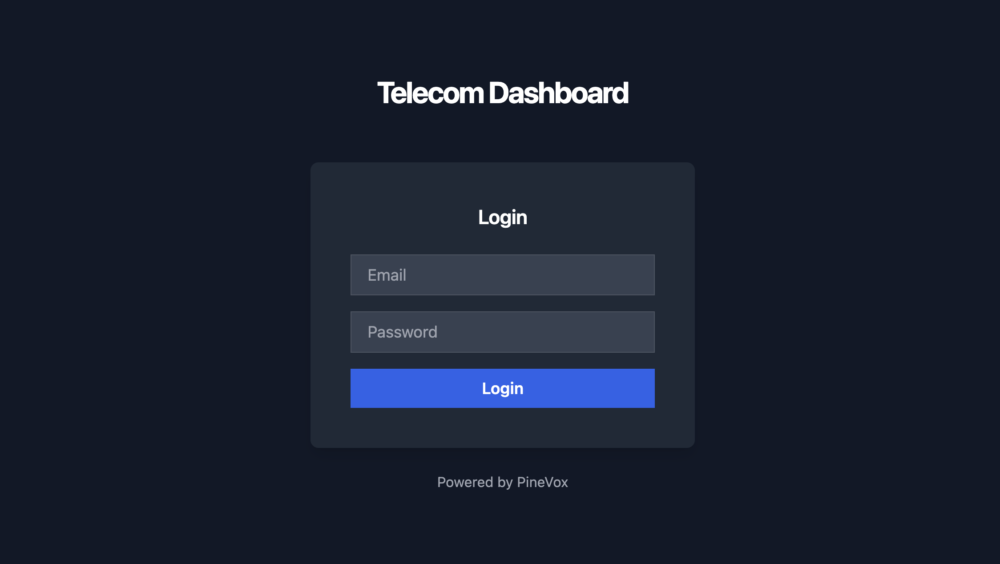
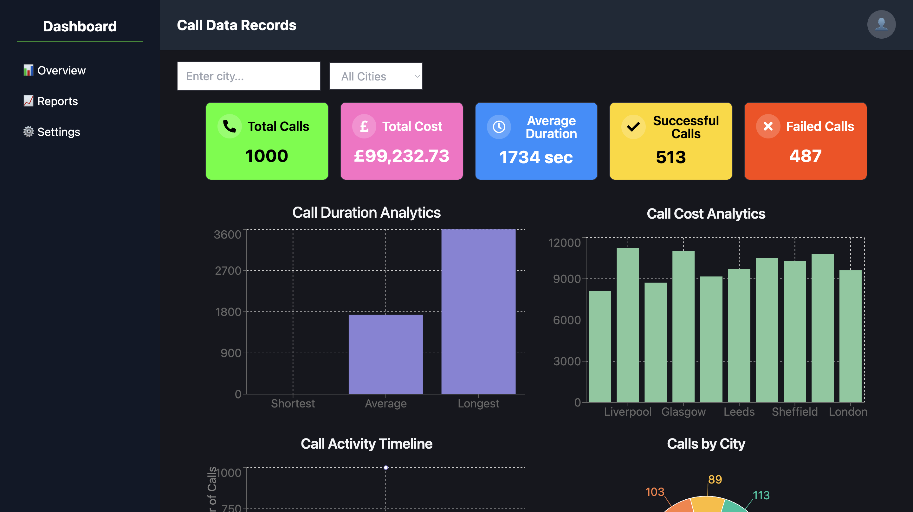
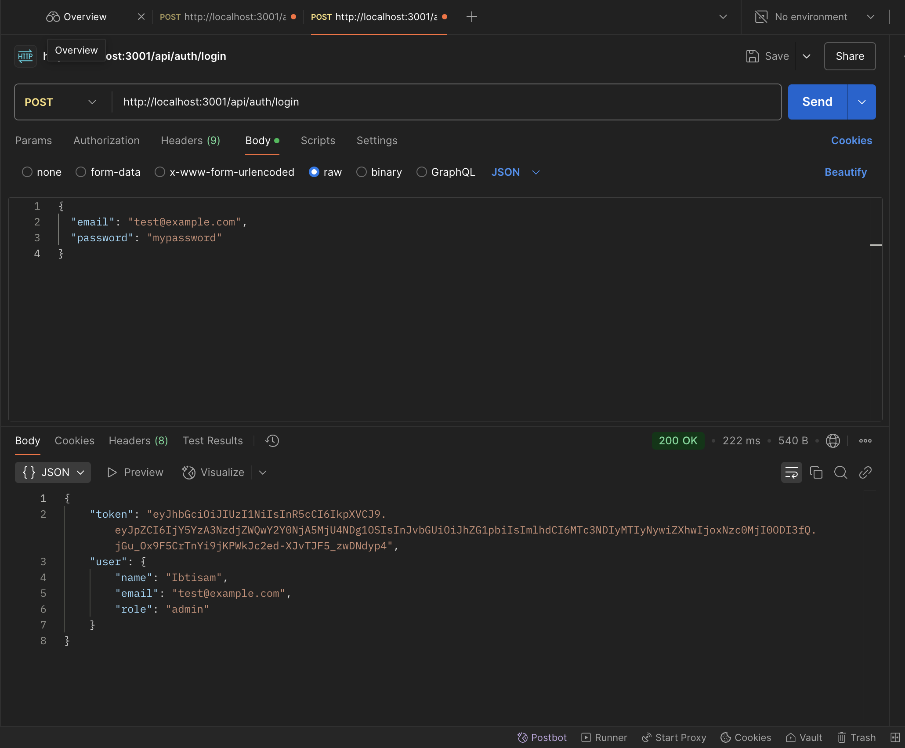
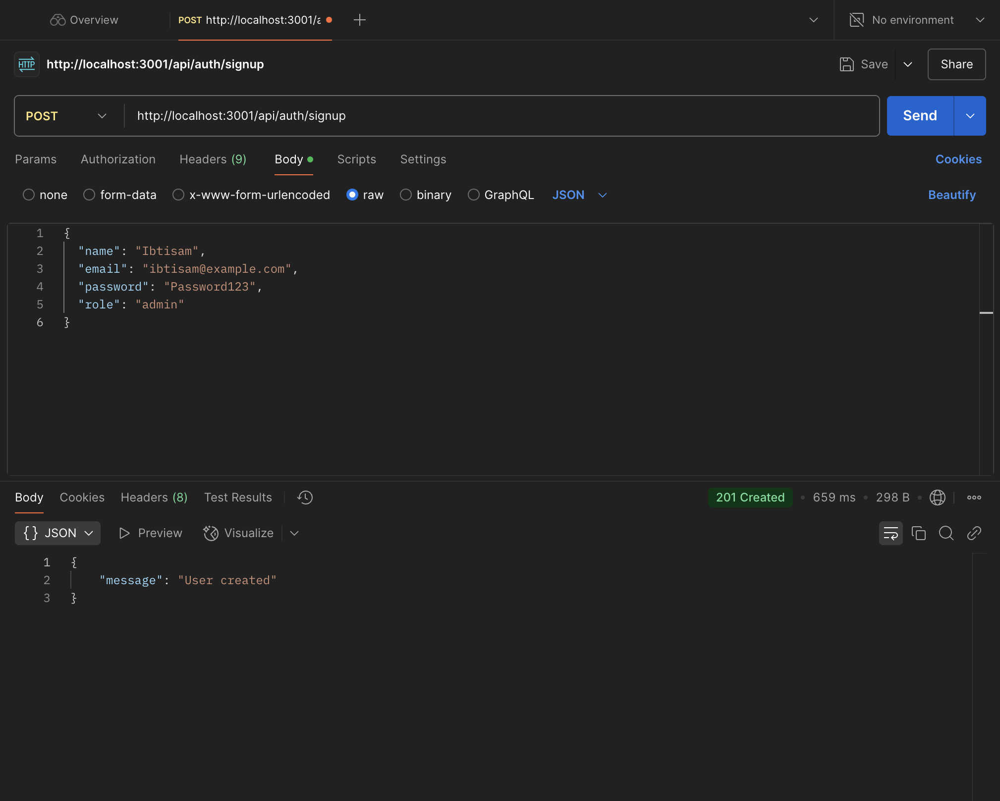
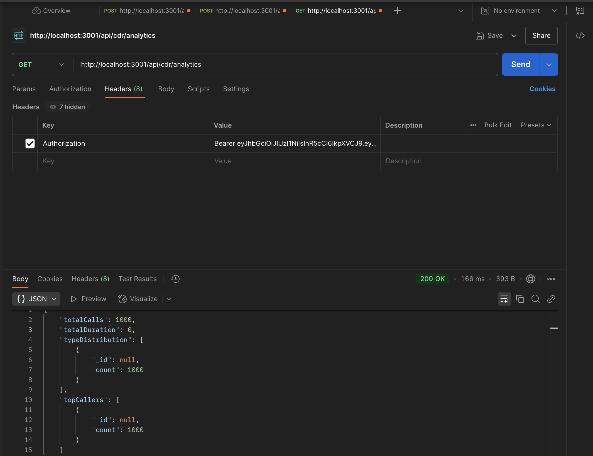

# CDR Dashboard Full-Stack

## Overview
The CDR Dashboard is a full-stack web application for managing **Call Data Records (CDRs)**. It combines a **React frontend** with a **Node.js/Express backend**, showing a complete workflow from login and authentication to displaying dynamic data in a dashboard.

**Key Features:**
- Secure user login using JWT tokens
- Interactive dashboard displaying CDR data
- Responsive design with TailwindCSS
- Backend routes for handling CDR data
- API testing with Postman to verify endpoints

---

## Tech Stack
- **Frontend:** React, Vite, TailwindCSS
- **Backend:** Node.js, Express
- **Database:** MongoDB
- **Authentication:** JWT tokens
- **API Testing:** Postman
- **Other Tools:** Git/GitHub, VSCode

---

## How the Project Works
The frontend fetches CDR data from the backend when a user logs in. All API requests include a **JWT token** for authentication, ensuring only authorized users can access the data. The dashboard displays this data dynamically, updating whenever new information is retrieved from the backend.

Postman was used to test the backend routes before connecting them to the frontend to ensure everything works correctly.

---

## Project Structure 
- **Frontend:** React components are in `src/components/` and pages like Login and Dashboard are in `src/pages/`. Static assets are in `public/`. Config files include `package.json`, `vite.config.js`, `tailwind.config.js`, and `postcss.config.js`.
- **Backend:** All backend logic is in `telecom-backend/`. Key files include `auth.js`, `cdr.js`, `cdrRoutes.js`, `tokenCheck.js`, `user.js`, and `index.js`. (Handles authentication and CDR routes)
- **Screenshots:** All screenshots, including Postman API tests, are in the `screenshots/` folder.

---

## Setup & Running the Project

### Backend
```bash
git clone https://github.com/ibtisam3/cdr-dashboard-fullstack.git
```

```bash
cd telecom-backend
```

```bash
npm install
```

```bash
npm run dev
```
# The backend will now be running at http://localhost:3001

### Frontend
```bash
cd cdr-dashboard-fullstack
```

```bash
npm install
```

```bash
npm run dev
```
# The Frontend will now be running at http://localhost:5173

## Screenshots

### Login


### Dashboard


### API & Authentication Testing




